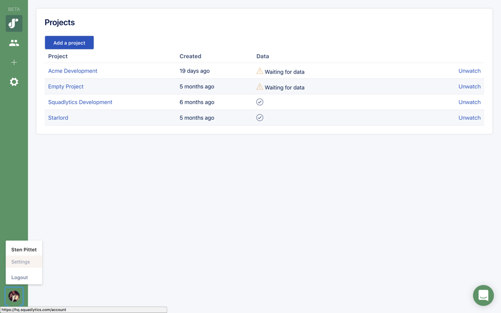

## 1. Connect your Bitbucket account to Squadlytics

Go to your account settings by clicking on your avatar in the left sidebar and then settings.

Go to ***Integrations > Connected services*** and click on the `Add new` button.

Click on the Bitbucket logo to connect your Bitbucket account.

## 2. Add repositories to a project

You can add one or more repositories to a project. Once added Squadlytics will automatically monitor commits, pull requests and pipelines in the repositories.

In your project settings go to the section ***Integrations > Repositories***.

Click on the `Add new` button to connect a new repository to your project.

In the integration form select ***Bitbucket*** for the repository service and add your full repository name including your Bitbucket account (acme-account/acme-repository).

After hitting `Create` you should see a new repository integration for your project.

## 3. Wait for data

You can now go back to the home page of your project. It will be updated with data from your repository as soon as your team starts pushing commits.