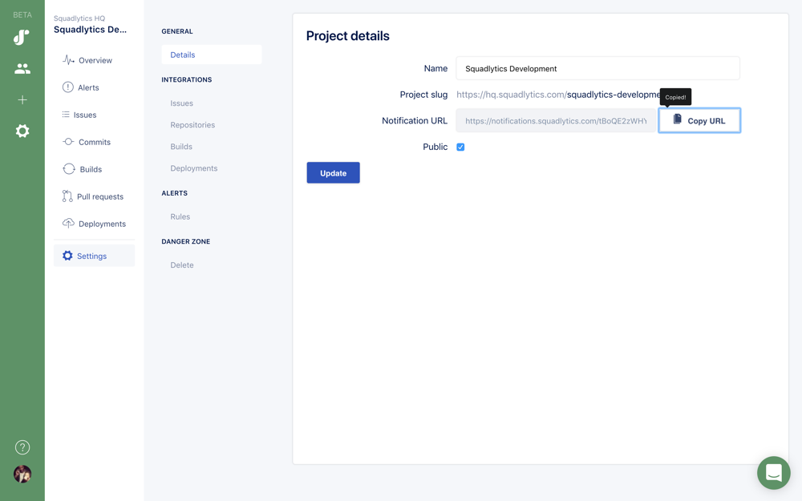
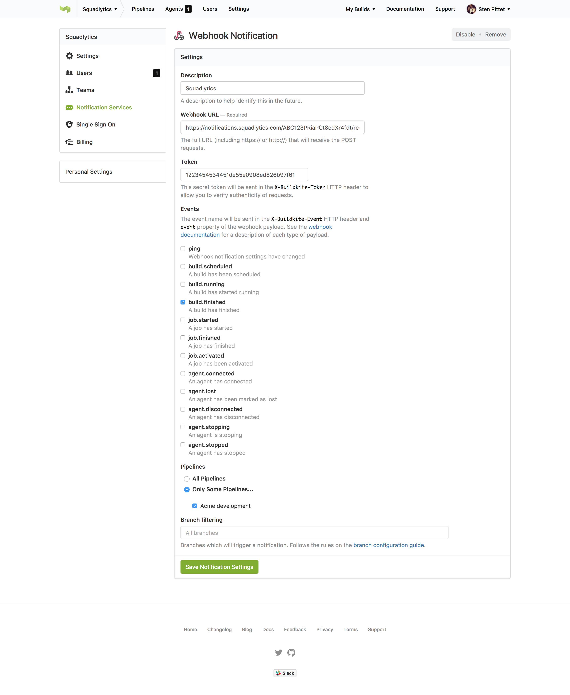

Follow the instructions below to track your Buildkite activity in your projects.

##1. Copy your project notification URL

Projects in Squadlytics have their own notification URL that allow them to receive data from your tools.

Go to your project settings to copy its notification URL.

##2. Create a webhook in Buildkite

In your Buildkite account go to ***Settings > Notification services*** to create a new webhook.

Create webhook with the following configuration:

  * **Webhook URL**: Paste your notification URL here
  * **Events**: Select __build.finished__
  * **Pipelines**: Select all the pipelines that you want to associate with the project

Your form should look like the picture below.

##3. Wait for data

Just save your webhook to start receiving builds data in your Squadlytics project. The data will appear as soon as there is some activity in the relevant pipelines.