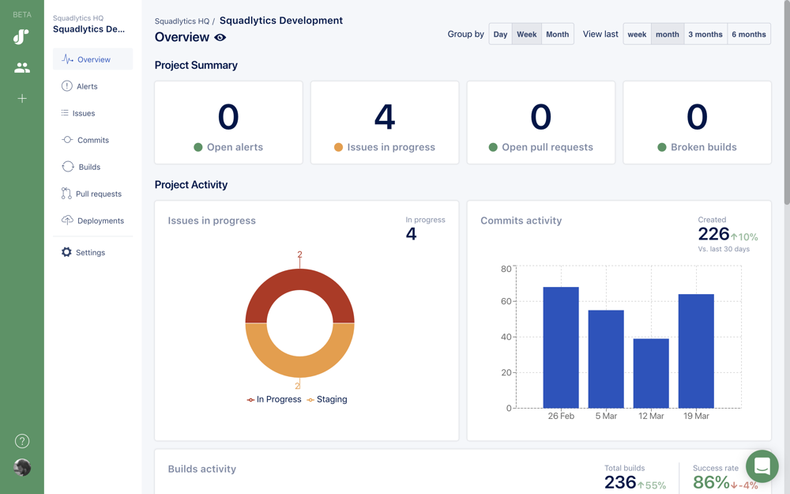

## What is Squadlytics?

Squadlytics keeps track of the activity in your projects to help you measure and improve your productivity.

It automatically creates reports for you and can notify you when it detects anomalies in your projects.

## Getting started

There are only a few steps required to get started.

  1. Sign up for your workspace
  2. Create a project
  3. Connect your tools
  4. Get data!

## 1. Sign up for your workspace

When you sign up for Squadlytics you get a new workspace with its own URL like https://acme.squadlytics.com. All your projects and data will be self-contained inside of your workspace and you will be able to customize its configuration. 

You can go to https://squadlytics.com/signup to create your own workspace.

## 2. Create a new project

Projects allow you to aggregate data from multiple sources in the same place. If you have a new instance you can simply use the "Create project" button on the home page to add a new project.

## 3. Connect your tools

Squadlytics allow you to connect repositories, issues, builds and deployments to a project to start measuring activity. Follow the corresponding guides below to see how you can integrate your existing tools to Squadlytics.

### Issues

  * [Jira](/jira-integration) 

### Repositories

  * [Bitbucket](/bitbucket-cloud-integration) (Bitbucket Pipelines data is automatically captured)
  * [Github](/github-cloud-integration) 

### Builds

  * [Buildkite](/buildkite-integration)

### Deployments

  * [Heroku](/heroku-integration)
  * [Squadlytics CLI](/squadlytics-cli)

## 4. Get data!

That's it! Data will start appearing in Squadlytics as soon as your team perfoms action in any of the tools connected.

