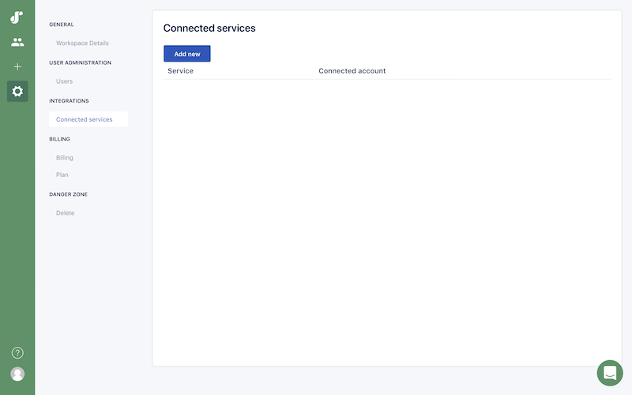

## Requirements

You need to be a Squadlytics admin or owner to connect Slack to your Squadlytics workspace.

## 1. Connect your Slack workspace to Squadlytics

Go to your workspace settings by clicking on the cog icon in the left sidebar.

Then go to *Integrations > Connected services* and click on the `Add new` button.

In the next screen click on the Slack icon to connect your account to your Squadlytics workspace.

Once authorized you should see a new service connection in the list of your connected services.

## 2. Add squadbot to your Slack channels

To receive notifications in your Slack channels you just need to add our bot by mentioning it with **@squadbot** in the right channel.

Once added the bot will be able to notify your team directly when productivity issues are detected or project rules are broken.

## 3. Configure Squadbot in your projects

The last thing you need to do is to indicate which Slack channel should be used for notification in your projects.

Go to your project settings and then *Alerts & notifications > Squadbot*.

Just add the name of your Slack channel to start receiving notifications there.